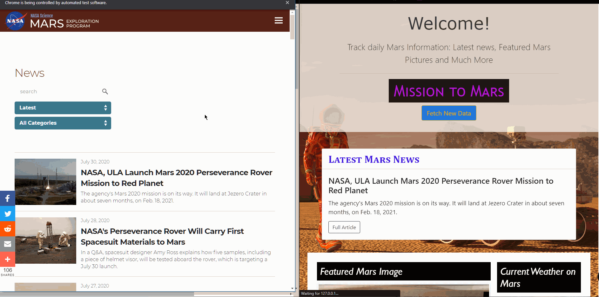

# Welcome to The Red Planet ...  *MARS !*
## 1. Background

For over 30 years since the first human kind's close-up of this planet in 1965, Mars Exploration has never stopped being a top-trending topic. The more we look, the more interesting facts we found about this 4th planet from the Sun, such as "polar ice caps and clouds in its atmosphere, seasonal weather patterns, volcanoes, canyons and other recognizable features" (*mars.nasa.gov*).

In this project, a web application is built to scrape multiple websites for data related to NASA Mars Exploration Program. All scraped data is stored in a MongoDB table, queried, and displayed on a comprehensive single HTML page.  

<a class = "btn" href="./static/images/web_look.jpg">**Click here**
</a> to see the final page image. 

  

## 2. Languages, Tools &  Techniques
* Languges:
  * Python | HTML5 / CSS3 | Markdown
* Python Modules:
  * Flask | Spinter (Chromedriver) | Beautiful Soup | Pandas | PyMongo | Jinja
* HTML Libraries:
  * Bootstrap
* noSQL Database:
  * MongoDB (<a href="https://www.mongodb.com/try/download/community">Installation Link</a>)
* Software/ Applications:
  * Jupyter Notebook | Visual Studio Code | Google Chrome v. 84 | Windows Terminal | Git Bash
* Operating System:
  * Windows 10 Pro, ver. 1909

## 3. Table of Contents

All files are stored in the folder and sub-folder of "Missions_to_Mars"

 **FOLDER NAME** | **CONTENTS** |
:----------------|:-------------|
**Chromedriver-v84** | Chrome Driver for Google Chrome ver. 84
**Jupyter Notebook** | `Mission_to_Mars.ipynb`, utilized during developement of `scrape_mars.py`
 **static** | contains _style.css_, and pictures of HTML background, readme & final website screenshot|
  **templates** | contains _'index.html'_, main home page |
 **application.py** | Flask App to drive the website |
 **get_mars_data.py** | queries from MongoDB & shows data on main page  data |
 **load_mongo_db.py** | calls for new web-scraping and loading data into MongoDB |
 **scrape_mars.py** | scraps the data and export new data into new table |

## 4. Process Overview
### Step 1 - Develop Jupyter Notebook
* In the address bar type: `chrome://version/`, look for **Google Chrome** header indicating current Chrome version. For example:
  * `Google Chrome	84.0.4147.105 (Official Build) (64-bit) (cohort: Stable)`
* Download correct version of Chrome Driver, <a href="https://chromedriver.chromium.org/">link here.</a>
* Websites visited for scraping:

 **WEBSITE** | **WEB ADDRESS** |
 :---------- |:---------- | 
 **Mars Latest News** | https://mars.nasa.gov/news |
 **JPL Mars Featured Space Images**| https://www.jpl.nasa.gov/spaceimages |
 **Mars Weather** | https://twitter.com/marswxreport |
 **Mars Facts** | https://space-facts.com/mars | 
 **Mars Hemispheres** | https://astrogeology.usgs.gov/search/results?q=hemisphere+enhanced&k1=target&v1=Mars | 

* Capture all scraped data into a dictionary.
* Exported the Jupyter Notebook file to a Python file named *scrap_mars.py*.

### Step 2 - Build MongoDB Application 
File name: **load_mongo_db.py**
* Download and install MongoDB.
* Utilize PyMongo to establish the connection to MongoDB.
  * If there is server connection error, perform these steps:
    * Start -> Administrative Tools -> Services -> MongoDB.
    * Make sure MongoDB Server (MongoDB) Status is *Running*.
    * <a href="./static/images/start_db.jpg">Click here</a> for an image demo.
* Write the dictionary of all data (scrapped from _Step 1_) into MongoDB.

### Step 3 - Build Data Query Application from MongoDB 
File name: **get_mars_data.py**
* Utilize PyMongo to establish the connection to MongoDB.
* Query data in MongoDB.
* Prepare to send data back to Flask App.

### Step 4 - Build Flask / HTML Application
File names: **application.py** & **index.HTML**
* Build HTML template as the main webpage, formatted by CSS.
* Build different ***@route*** to connect with previous python app for querying on the existing data or scraping for new data, then render all data into an HTML template

### Step 5 - Start-up Procedure
* For first time use, launch **load_mongo_db.py** to load the first time dataset
* Open and run **application.py** to pull data from MongoDB, render data with HTML as a template

## Summary
* All data was successfully loaded / queried into MongoDB, no significant event occurs
* Three python files were built to split the codes into easier to read, troubleshoot, test, etc. when problems occur 
* The challenging part is writing CSS file to work with Flask & HTML
* Pending on internet connection, several websites took a very long time to load or not loading at all. This causes errors or missing data as the website has not yet done redering  HTML / CSS files   
* Many nested **"if-elif-else"** were used to patch up issues associated with slow or invalid website to ensure application processed without hiccup. A better way to do it is utilized **"try / error"** block to lean codes and improve working speed 

